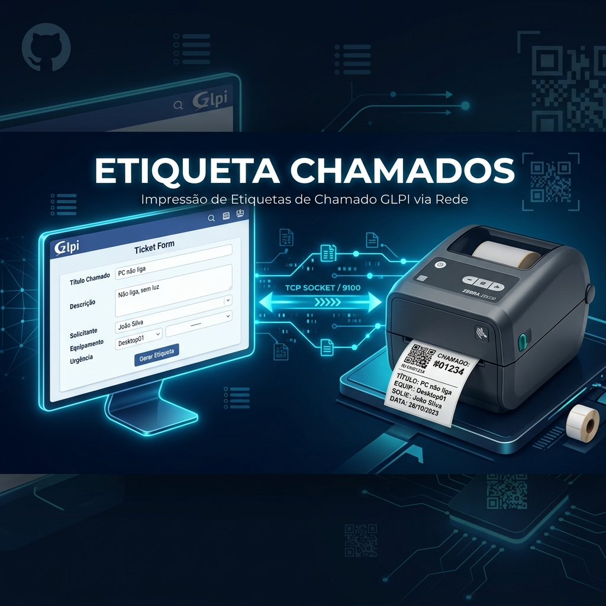
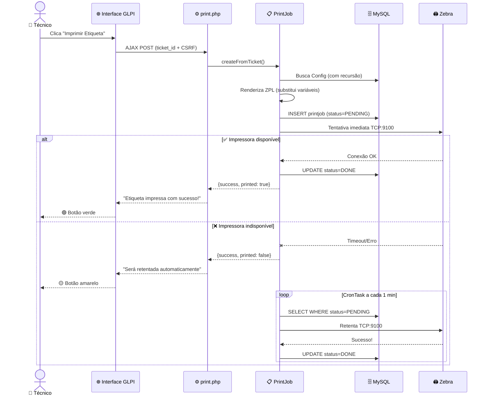

<p align="center">
  
</p>

<h1 align="center">🏷️ Etiqueta Chamados</h1>

<p align="center">
  <strong>Plugin GLPI para impressão automática de etiquetas de chamados em impressoras Zebra via rede TCP</strong>
</p>

<p align="center">
  
  
  
  
  
</p>

<p align="center">
  <a href="#-funcionalidades">Funcionalidades</a> •
  <a href="#-arquitetura">Arquitetura</a> •
  <a href="#-instalação">Instalação</a> •
  <a href="#%EF%B8%8F-configuração">Configuração</a> •
  <a href="#-template-zpl">Template ZPL</a> •
  <a href="#-estrutura-do-projeto">Estrutura</a>
</p>

---

## 📋 Sobre

**Etiqueta Chamados** é um plugin para [GLPI 10.0](https://glpi-project.org/) que adiciona um botão de **impressão direta de etiquetas** na tela de chamados (tickets). As etiquetas são enviadas em linguagem **ZPL** diretamente para impressoras Zebra via **socket TCP raw (porta 9100)**, eliminando a necessidade de drivers de impressão ou servidores intermediários.

O plugin foi projetado para ambientes de **service desk** e **suporte técnico** onde a identificação física rápida de chamados é essencial — seja para colar em equipamentos, documentos ou bancadas de trabalho.

---

## ✨ Funcionalidades

### 🖨️ Impressão Inteligente (Fire & Retry)
- **Tentativa imediata** ao clicar no botão — imprime na hora se a impressora estiver disponível
- **Fila de retentativa automática** — se falhar, o job fica pendente e o CronTask retenta a cada minuto
- **Feedback visual em tempo real** — o botão muda de cor conforme o resultado:

| Estado | Visual | Descrição |
|:---:|:---:|:---|
| 🟢 | `Impresso!` | Etiqueta impressa com sucesso na hora |
| 🟡 | `Na fila` | Falhou agora, será retentada automaticamente |
| 🔴 | `Erro` | Erro de configuração ou permissão |

### 🏢 Configuração por Entidade com Herança
- Cada entidade do GLPI pode ter sua **própria impressora configurada**
- Suporte completo à **recursividade do GLPI**: sub-entidades herdam automaticamente a configuração da entidade pai
- Configuração individual pode **sobrescrever** a configuração herdada

### 🔐 Controle de Permissões Granular
- Direito `plugin_etiquetachamados_print` — controla quem pode imprimir etiquetas
- Direito `plugin_etiquetachamados_config` — controla quem pode configurar impressoras
- Integração nativa com a **matriz de direitos** do GLPI por perfil

### 📝 Template ZPL Dinâmico
- Template totalmente customizável em **linguagem ZPL pura**
- Variáveis dinâmicas substituídas automaticamente por dados do chamado
- Suporte a **QR Code** para acesso rápido ao chamado via scan

### 🔄 Processamento Assíncrono
- Fila de impressão gerenciada via tabela no banco de dados
- CronTask integrado ao GLPI para processamento em background
- Logs detalhados de cada tentativa via `Toolbox::logInFile`

---

## 🏗️ Arquitetura

```
┌─────────────────────────────────────────────────────────────────┐
│                        GLPI Interface                           │
│                                                                 │
│  ┌──────────┐    AJAX POST     ┌──────────────┐                │
│  │  Botão   │ ───────────────▶ │  print.php   │                │
│  │ Imprimir │                  │  (endpoint)  │                │
│  └──────────┘                  └──────┬───────┘                │
│       ▲                               │                         │
│       │ feedback                      ▼                         │
│       │                        ┌──────────────┐                │
│       └────────────────────── │ createFrom   │                 │
│                                │ Ticket()     │                │
│                                └──────┬───────┘                │
│                                       │                         │
│                          ┌────────────┼────────────┐           │
│                          ▼            ▼            ▼           │
│                   ┌───────────┐ ┌──────────┐ ┌──────────┐     │
│                   │ Resolve   │ │ Render   │ │ Insert   │     │
│                   │ Config    │ │ ZPL      │ │ PrintJob │     │
│                   │(recursion)│ │(template)│ │ (DB)     │     │
│                   └───────────┘ └──────────┘ └────┬─────┘     │
│                                                    │            │
│                              ┌─────────────────────┤            │
│                              ▼                     ▼            │
│                     ┌─────────────┐      ┌──────────────┐      │
│                     │   Tentativa │      │   CronTask   │      │
│                     │   Imediata  │      │  (retentativa│      │
│                     │  (fire&try) │      │   a/ 1 min)  │      │
│                     └──────┬──────┘      └──────┬───────┘      │
│                            │                     │              │
│                            └──────────┬──────────┘              │
│                                       ▼                         │
│                              ┌─────────────────┐               │
│                              │   sendToPrinter  │               │
│                              │   (TCP Socket)   │               │
│                              └────────┬────────┘               │
└───────────────────────────────────────┼─────────────────────────┘
                                        │
                                        │ RAW TCP :9100
                                        ▼
                               ┌─────────────────┐
                               │  🖨️ Zebra ZD230  │
                               │   (ou compat.)   │
                               └─────────────────┘
```

### Fluxo de Impressão



---

## 📦 Instalação

### Pré-requisitos

| Requisito | Versão |
|:---|:---|
| GLPI | 10.0.0 — 10.0.99 |
| PHP | ≥ 7.4 |
| Extensão `sockets` | Habilitada |
| Função `fsockopen` | Disponível |
| Impressora | Zebra (ou compatível com ZPL via TCP) |

### Passo a Passo

**1. Clone o repositório na pasta de plugins do GLPI:**

```bash
cd /var/www/html/glpi/plugins
git clone https://github.com/ravisca/etiquetachamados.git
```

**2. Ative o plugin na interface do GLPI:**

```
Configurar → Plugins → Etiqueta Chamados → Instalar → Ativar
```

**3. Configure o CronTask do sistema operacional:**

```bash
# Adicione ao crontab (executar como root ou www-data)
crontab -e

# Adicione a linha abaixo para rodar a cada minuto:
* * * * * /usr/bin/php /var/www/html/glpi/front/cron.php &>/dev/null
```

> ⚠️ **Importante:** Sem esta configuração, a retentativa automática não funcionará. A impressão imediata (ao clicar no botão) funciona independentemente do cron.

**4. Verifique a instalação:**
- Acesse `Configurar → Plugins` e confirme que o status é "✅ Ativado"
- Acesse `Configurar → Ações automáticas` e confirme que "EtiquetaPrint" aparece na lista

---

## ⚙️ Configuração

### 1. Configurar a Impressora (por Entidade)

```
Administração → Entidades → [Selecione a entidade] → Aba "Etiqueta Chamados"
```

| Campo | Descrição | Exemplo |
|:---|:---|:---|
| **IP da Impressora** | Endereço IP ou hostname da Zebra na rede | `192.168.1.100` |
| **Porta TCP** | Porta RAW da impressora (padrão: 9100) | `9100` |
| **Recursivo** | Herdar configuração para sub-entidades | `Sim` |
| **Ativo** | Habilitar/desabilitar impressão | `Sim` |
| **Template ZPL** | Código ZPL com variáveis dinâmicas | *(ver seção abaixo)* |

### 2. Configurar Permissões (por Perfil)

```
Administração → Perfis → [Selecione o perfil] → Aba "Etiqueta Chamados"
```

| Permissão | Descrição |
|:---|:---|
| **Impressão de etiquetas** | Permite ao usuário ver o botão e imprimir etiquetas |
| **Configuração de etiquetas** | Permite ao usuário configurar impressoras nas entidades |

### 3. Herança de Entidades (Recursividade)

O plugin respeita a árvore de entidades do GLPI:

```
🏢 Entidade Raiz (IP: 10.0.0.1)     ← Configuração definida aqui
  ├── 📁 Filial SP                    ← Herda 10.0.0.1 (recursivo)
  │   ├── 📁 TI                       ← Herda 10.0.0.1
  │   └── 📁 RH                       ← Herda 10.0.0.1
  └── 📁 Filial RJ (IP: 10.0.0.2)   ← Sobrescreve com 10.0.0.2
      └── 📁 Suporte                  ← Herda 10.0.0.2
```

---

## 🏷️ Template ZPL

### Variáveis Disponíveis

| Variável | Descrição | Exemplo de saída |
|:---|:---|:---|
| `{{ticket_id}}` | Número do chamado | `1234` |
| `{{ticket_title}}` | Título do chamado | `PC não liga` |
| `{{ticket_date}}` | Data de abertura (dd/mm/yyyy HH:mm) | `31/03/2026 14:30` |
| `{{entity_name}}` | Nome da entidade do chamado | `Filial São Paulo` |
| `{{requester_name}}` | Nome do solicitante | `João Silva` |
| `{{ticket_content}}` | Descrição (primeiros 200 caracteres) | `O computador da sala...` |
| `{{ticket_url}}` | URL completa para acesso ao chamado | `http://glpi.empresa.com/front/ticket.form.php?id=1234` |

### Exemplo de Template

```zpl
^XA
^CI28

^PW400
^LL240

^FO20,20
^A0N,25,25
^FDEntidade:^FS

^FO20,50
^A0N,35,35
^FD{{entity_name}}^FS

^FO20,120
^A0N,25,25
^FDTicket:^FS

^FO20,150
^A0N,50,50
^FD{{ticket_id}}^FS

^FO250,40
^BQN,2,5
^FDQA,{{ticket_url}}^FS

^XZ
```

> 💡 **Dica:** O QR Code (`^BQ`) com `{{ticket_url}}` permite que o técnico escaneie a etiqueta com o celular e acesse o chamado diretamente no GLPI.

---

## 📂 Estrutura do Projeto

```
etiquetachamados/
├── 📄 setup.php                    # Registro do plugin, hooks e inicialização
├── 📄 hook.php                     # Install/uninstall, migração de banco e hooks
│
├── 📁 inc/                         # Classes do plugin (backend)
│   ├── 📄 config.class.php         # Configuração por entidade (CommonDBTM)
│   ├── 📄 printjob.class.php       # Fila de impressão + CronTask + envio TCP
│   ├── 📄 profile.class.php        # Gestão de permissões por perfil
│   └── 📄 ticket.class.php         # Injeção do botão no formulário do chamado
│
├── 📁 front/                       # Controladores (endpoints)
│   ├── 📄 config.form.php          # Página de configuração do plugin
│   └── 📄 print.php                # Endpoint AJAX para impressão
│
├── 📁 js/
│   └── 📄 etiquetachamados.js      # Lógica do botão (AJAX + feedback visual)
│
├── 📁 css/
│   └── 📄 etiquetachamados.css     # Estilos do botão e animações
│
├── 📁 locales/                     # Internacionalização
│   ├── 📄 pt_BR.po                 # Português do Brasil
│   └── 📄 en_GB.po                 # Inglês
│
└── 📁 docs/
    └── 🖼️ banner.png               # Banner do repositório
```

---

## 🗄️ Banco de Dados

O plugin cria duas tabelas na instalação:

### `glpi_plugin_etiquetachamados_configs`

Armazena a configuração da impressora por entidade.

| Coluna | Tipo | Descrição |
|:---|:---|:---|
| `id` | INT (PK) | Identificador |
| `entities_id` | INT (FK) | Entidade vinculada |
| `is_recursive` | TINYINT | Herdar para sub-entidades |
| `printer_ip` | VARCHAR(255) | IP ou hostname da impressora |
| `printer_port` | INT | Porta TCP (padrão: 9100) |
| `zpl_template` | TEXT | Template ZPL com variáveis |
| `is_active` | TINYINT | Se a impressão está ativa |

### `glpi_plugin_etiquetachamados_printjobs`

Fila de jobs de impressão assíncrona.

| Coluna | Tipo | Descrição |
|:---|:---|:---|
| `id` | INT (PK) | Identificador |
| `tickets_id` | INT (FK) | Chamado associado |
| `entities_id` | INT (FK) | Entidade do chamado |
| `users_id` | INT (FK) | Usuário que solicitou |
| `status` | INT | `0`=Pendente `1`=Processando `2`=Concluído `3`=Erro |
| `zpl_content` | TEXT | ZPL renderizado (com dados) |
| `error_message` | TEXT | Mensagem de erro (se houver) |

---

## 🔧 Impressoras Compatíveis

| Modelo | Status | Protocolo |
|:---|:---:|:---|
| **Zebra ZD230** | ✅ Testado | RAW TCP :9100 |
| Zebra ZD220 | ✅ Compatível | RAW TCP :9100 |
| Zebra ZD420/ZD620 | ✅ Compatível | RAW TCP :9100 |
| Zebra GC/GK Series | ✅ Compatível | RAW TCP :9100 |
| Qualquer impressora ZPL com TCP | ✅ Compatível | RAW TCP :9100 |

> ℹ️ Qualquer impressora que aceite linguagem ZPL via socket TCP na porta 9100 é compatível.

---

## 📊 Logs e Monitoramento

Os logs do plugin ficam em:

```
{GLPI_ROOT}/files/_log/etiquetachamados.log
```

Exemplo de log:

```log
2026-03-31 17:01:29 [@srvglpinew]
Job #1 criado para ticket #24 (entidade #0)

2026-03-31 17:01:29 [@srvglpinew]
Job #1: Impressão imediata enviada com sucesso para 10.0.250.9:9100
```

---

## 🤝 Contribuição

1. Faça um **fork** do projeto
2. Crie uma branch para sua feature: `git checkout -b feat/minha-feature`
3. Faça commit com [Conventional Commits](https://www.conventionalcommits.org/): `git commit -m 'feat: adiciona suporte a etiqueta dupla'`
4. Envie para o repositório: `git push origin feat/minha-feature`
5. Abra um **Pull Request**

---

## 📜 Licença

Este projeto é distribuído sob a licença **GPLv2**. Veja o arquivo [LICENSE](LICENSE) para mais detalhes.

---

<p align="center">
  Desenvolvido com ❤️ por <strong><a href="https://github.com/ravisca">RBX Soluções & Tech</a></strong>
</p>

<p align="center">
  <sub>Plugin feito para GLPI por quem vive GLPI. 🇧🇷</sub>
</p>
